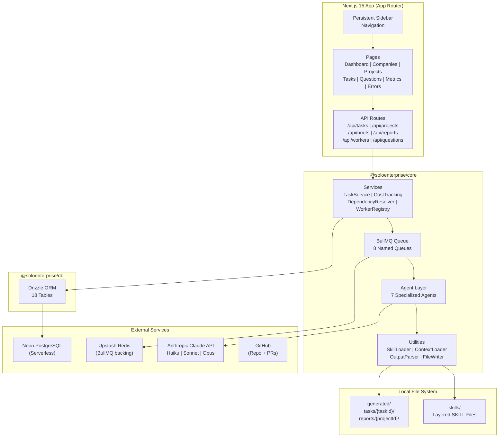
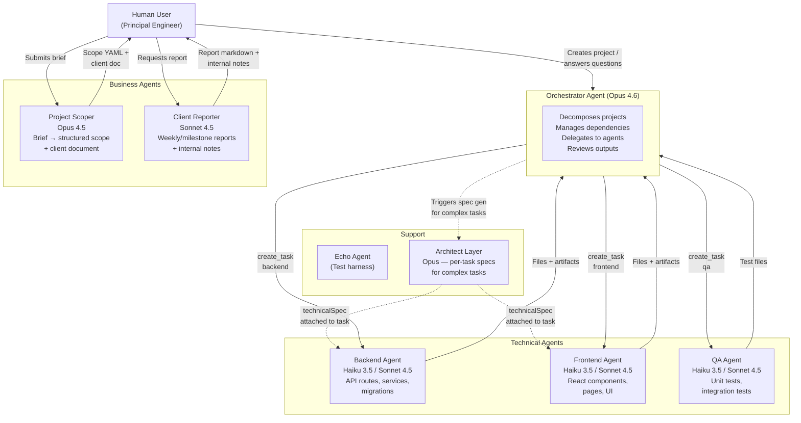
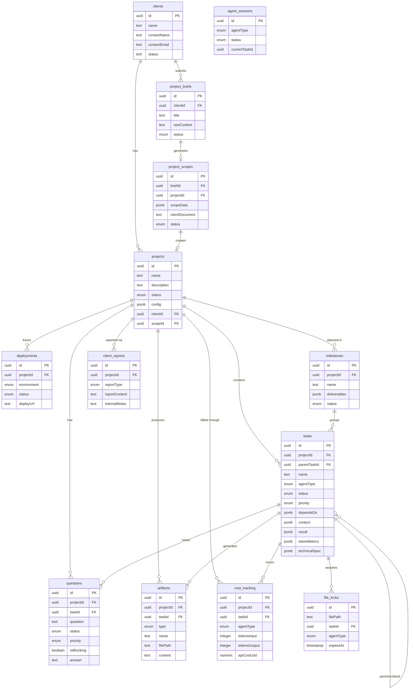
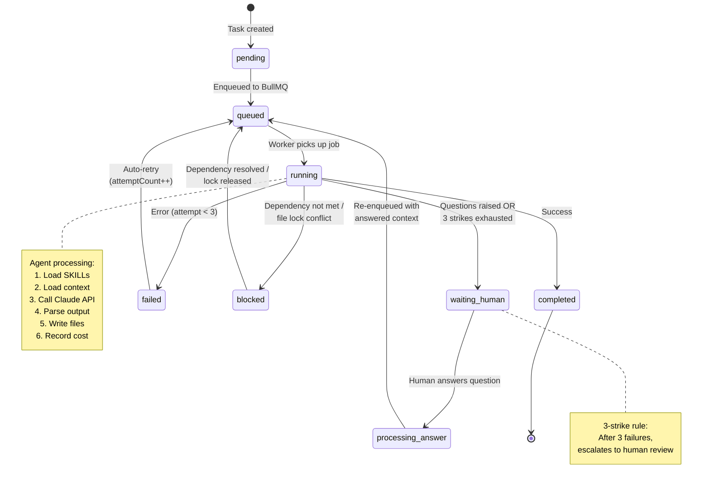
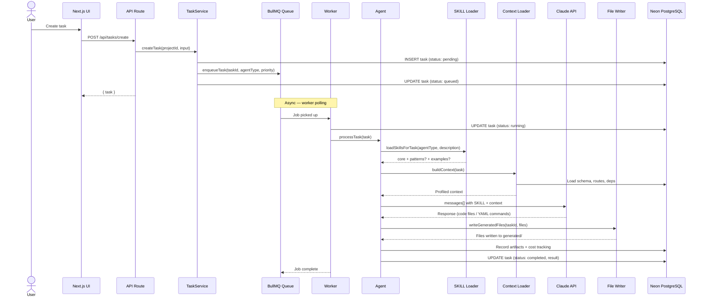
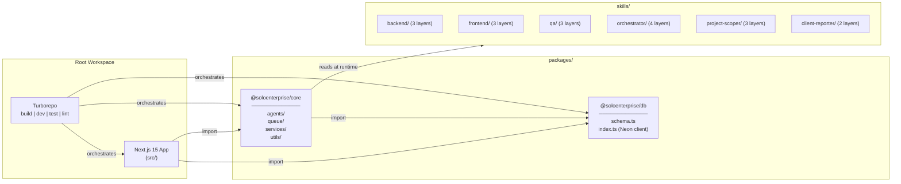
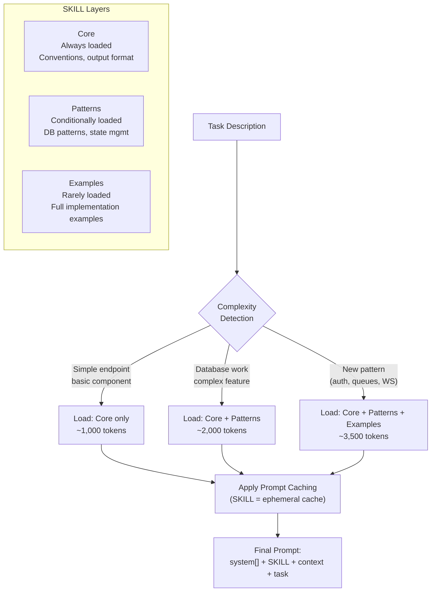
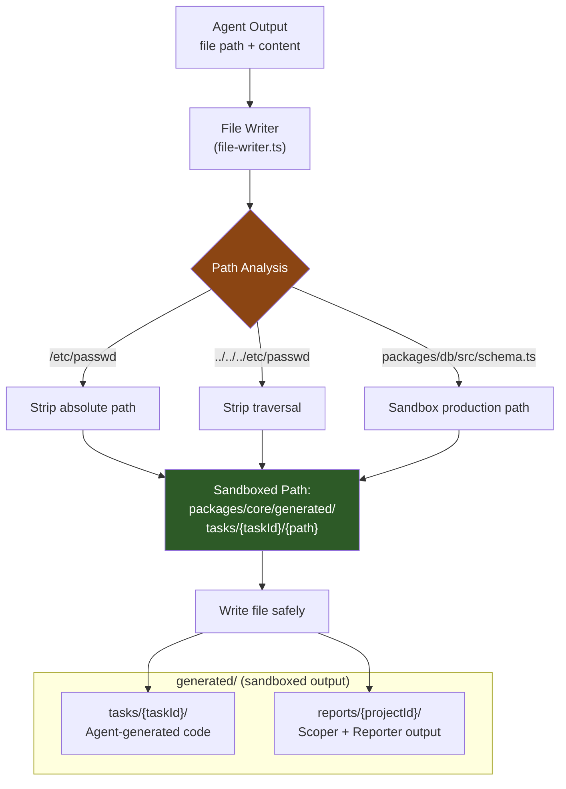
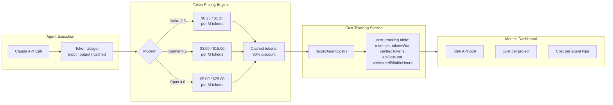

# SoloEnterprise — Architecture Diagrams

> Visual architecture reference. Render in VS Code with **Markdown Preview Mermaid Support** extension, or view directly on GitHub.

---

## 1. System Architecture (High-Level)

---

## 2. Agent Ecosystem

---

## 3. Database Schema (Entity Relationships)

---

## 4. Task Lifecycle (State Machine)

---

## 5. Request Flow (End to End)

---

## 6. Monorepo Package Graph

---

## 7. SKILL Loading Strategy

---

## 8. Consulting Pipeline Flow

```mermaid
flowchart LR
    subgraph Input["Client Input"]
        Brief["Project Brief<br/>(raw text)"]
    end

    subgraph Scoping["Project Scoper Agent"]
        Analyze["Analyze brief<br/>+ ask clarifying Qs"]
        Scope["Generate scope:<br/>YAML spec +<br/>client document"]
    end

    subgraph Approval["Human Review"]
        Review["Principal reviews<br/>scope + estimates"]
        Approve{"Approved?"}
    end

    subgraph Execution["Project Execution"]
        Project["Create Project<br/>+ Milestones"]
        Orchestrator["Orchestrator<br/>decomposes into tasks"]
        Agents["Tech Agents<br/>execute tasks"]
    end

    subgraph Reporting["Client Reporter Agent"]
        Report["Generate report:<br/>weekly / milestone /<br/>summary"]
        Deliver["Client-facing<br/>markdown report +<br/>internal notes"]
    end

    Brief --> Analyze
    Analyze --> Scope
    Scope --> Review
    Review --> Approve
    Approve -->|"Yes"| Project
    Approve -->|"No / Changes"| Analyze
    Project --> Orchestrator
    Orchestrator --> Agents
    Agents --> Report
    Report --> Deliver
```

---

## 9. File Sandbox Security Model

---

## 10. Cost Tracking Flow

